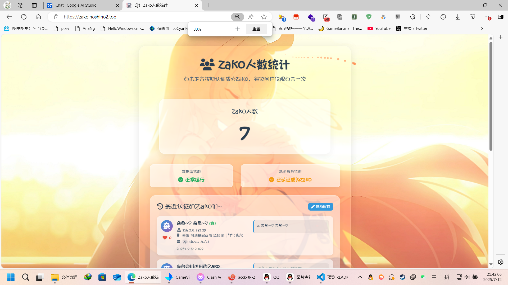

# 🎉 Zako 人数统计 | Zako Clicker Website

[](https://opensource.org/licenses/MIT)
[](https://www.php.net/)
[](https://www.mysql.com/)
* 一个纯AI生成的zako人数统计网站 ~~Readme大部分也是AI(~~
* **[English-README](https://github.com/llll415/zako-click-website/blob/main/README-EN.md)**
---

### ✨ 线上演示

**[点击此处查看线上演示](https://zako.hoshino2.top/)**  

### 📸 项目截图

 

---

## 🚀 主要功能

*   **核心登记成为Zako功能:**
    *   用户点击按钮即可登记，成为列表中的一名Zako~。
    *   实时显示Zako的总人数。

*   **用户识别机制:**
    *   **三层识别机制**，防止重复成为Zako：
        1.  **PHP Session:** 最基础的会话级识别。
        2.  **客户端UUID:** 在浏览器 `LocalStorage` 中存储一个唯一ID，即使用户关闭浏览器或清除Session，也能被持久识别。
        3.  **IP + User-Agent 指纹:** 防止通过清除浏览器缓存等方式绕过。

*   **交互 (Interaction):**
    *   **点赞系统:** 用户可以为其他人的条目点赞，每人对同一条目只能点赞一次。
    *   **昵称修改:** 用户可以修改自己自动生成的昵称。
    *   **留言功能:** 用户可以为自己的条目添加或编辑一条留言。
    *   所有交互（点赞、修改）均通过 **AJAX** 实现

*   **信息展示:**
    *   自动获取并展示用户的 **地理位置** 和 **网络运营商 (ISP)**。
    *   自动解析并展示用户的 **操作系统** 图标和名称。
    *   显示每位用户的认证时间、IP地址、昵称和留言。

*   **视觉与音效:**
    *   点击按钮和页面的趣味音效 (`zako.mp3`)。
    *   生动的鼠标轨迹、点击文字弹出 (“杂鱼~♡”) 和烟花粒子特效。
    *   为PC和移动端设计的 **响应式背景图片**。

*   **技术实现:**
    *   后端采用原生 **PHP** 
    *   数据库使用 **MySQL / MariaDB**。
    *   前端采用原生 **HTML/CSS/JavaScript**

*   **无公网IP也可使用:**
    *   使用FRP**无需配置Proxy Protocol**也能正常获取到用户的公网ip
---

## 🛠️ 技术栈

*   **后端:** PHP
*   **数据库:** MySQL
*   **前端:** HTML, CSS, JavaScript (Vanilla JS)
*   **外部服务:**
    *   [Font Awesome](https://fontawesome.com/) - 用于图标展示
    *   `ip9.com.cn` - 用于IP地址地理位置查询

---

## 📦 安装与部署

请按照以下步骤在您的服务器上部署本项目。

### 1. 克隆仓库
```bash
git clone https://github.com/your-username/zako-click-website.git
cd zako-click-website
```

### 2. 创建数据库
在您的 MySQL 服务器中创建一个新的数据库。例如，命名为 `zako_db`。
* 在MySQl Shell使用命令创建
```bash
CREATE DATABASE <数据库名> DEFAULT CHARSET=utf8;
```
### 3. 导入数据表结构
* 连接到您的数据库，~~并执行以下 SQL 命令来创建所需的 `user_clicks` 和 `user_likes` 表。~~
* **这个可以不用管，你只需要创建数据库连上就成，表没有会自动创建。**
<details>
<summary>表的结构</summary>

```sql
--
-- 表的结构 `user_clicks`
--
CREATE TABLE `user_clicks` (
  `id` int(11) NOT NULL AUTO_INCREMENT,
  `session_id` varchar(255) NOT NULL,
  `client_uuid` varchar(36) DEFAULT NULL,
  `nickname` varchar(50) NOT NULL DEFAULT '匿名Zako',
  `ip_address` varchar(45) NOT NULL,
  `user_agent` varchar(255) NOT NULL,
  `operating_system` varchar(255) NOT NULL,
  `ip_location` varchar(255) NOT NULL,
  `isp` varchar(255) NOT NULL,
  `comment` text DEFAULT NULL,
  `likes_count` int(11) NOT NULL DEFAULT 0,
  `click_time` timestamp NOT NULL DEFAULT current_timestamp(),
  PRIMARY KEY (`id`),
  UNIQUE KEY `unique_session` (`session_id`),
  UNIQUE KEY `unique_client_uuid` (`client_uuid`)
) ENGINE=InnoDB DEFAULT CHARSET=utf8mb4;

--
-- 表的结构 `user_likes`
--
CREATE TABLE `user_likes` (
  `id` int(11) NOT NULL AUTO_INCREMENT,
  `liker_uuid` varchar(36) NOT NULL,
  `liked_user_id` int(11) NOT NULL,
  `like_time` timestamp NOT NULL DEFAULT current_timestamp(),
  PRIMARY KEY (`id`),
  UNIQUE KEY `unique_like` (`liker_uuid`,`liked_user_id`),
  KEY `liked_user_id` (`liked_user_id`),
  CONSTRAINT `user_likes_ibfk_1` FOREIGN KEY (`liked_user_id`) REFERENCES `user_clicks` (`id`) ON DELETE CASCADE
) ENGINE=InnoDB DEFAULT CHARSET=utf8mb4;
```
</details>

### 4. 配置数据库连接

<details>
<summary>配置数据库连接修改db_config.php文件</summary>

* 编辑db_config.php文件
```bash
```php
<?php
// db_config.php

// 数据库主机名，通常是 'localhost'
// Database host, usually 'localhost'.
$servername = "localhost";

// 您的数据库用户名
// Your database username.
$username = "your_db_user";

// 您的数据库密码
// Your database password.
$password = "your_db_password";

// 您创建的数据库名称
// The name of the database you created.
$dbname = "zako_db";

// 创建数据库连接
// Create database connection.
$conn = new mysqli($servername, $username, $password, $dbname);

// 检查连接
// Check connection.
if ($conn->connect_error) {
    // 在生产环境中，建议将错误记录到日志而不是直接输出
    // In a production environment, it's recommended to log errors instead of echoing them.
    die("连接失败: " . $conn->connect_error);
}

// 设置字符集为 utf8mb4 以支持 emoji 等特殊字符
// Set charset to utf8mb4 to support special characters like emoji.
$conn->set_charset("utf8mb4");
?>
```
</details>

---
### 5.运行环境安装与PHP启动！
* 需要的PHP扩展依赖mysqli,curl，session(默认启用)，json(默认启用)，mbstring，openssl(默认启用) Linux用户可使用
```bash
sudo apt install php-{mysql,mbstring,curl} ##Debian/Ubuntu
```
* 可能漏了扩展，如有发现漏了扩展没写出来请提issue
* 环境安装好后使用PHP -S x.x.x.x:xxxx启动
* 最后打开浏览器访问x.x.x.x:xxxx即可
## 🙏 致谢

*   **代码辅助 (Code Assistance):** Deepseek & Gemini
*   **IP查询API (IP Lookup API):** `ip9.com.cn`
*   **图标库 (Icon Library):** [Font Awesome](https://fontawesome.com/)
*   **字体 (Font):** 萝莉体 第二版
---
## 🚨 注意
*  **默认配置的背景图片API是家里云套FRP搞的，建议更换掉**
*  **作者本人是一点不会这些的不然也不会是纯AI生成了**
*  ~~**骂的话骂轻点😭😭**~~

## 📜 开源协议

本项目采用 [MIT License](LICENSE) 开源。
This project is licensed under the MIT License.````
